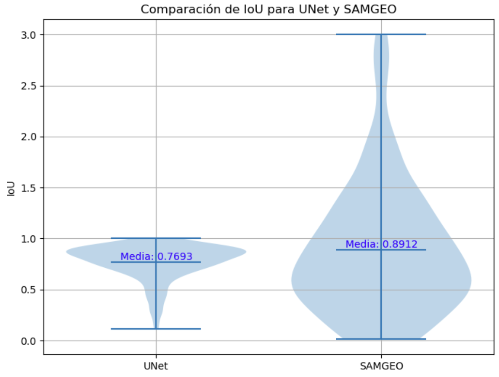

# Evaluación de la Segmentación Automática usando SAM y UNET

Este repositorio contiene un análisis comparativo entre dos modelos de segmentación automática: SAM y UNET. La evaluación se centra en métricas de segmentación como IoU (Intersection over Union) para determinar la precisión de cada modelo.

## Contenido

- `SAM_Generacion_mask.ipynb`: Cuaderno que utiliza el modelo SAM para la generación automática de máscaras de segmentación.
- `Segmentacion_Unet.ipynb`: Cuaderno que implementa y evalúa un modelo UNET personalizado para la segmentación.

## Resumen

El objetivo de este ejercicio es comparar segmentación semántica de Unet con Samgeo, a partir de un dataset de cuerpos de agua en imágenes Sentinel-2 (RGB). Para ello, se utilizan métricas como IoU que permiten evaluar qué tan bien cada modelo segmenta diferentes tipos de objetos en las imágenes.

### Resultados

- **SAM**: Proporciona segmentaciones automáticas basadas en el modelo SAM.
- **UNET**: Implementación personalizada del modelo UNET para segmentación, evaluada con las mismas imágenes y métricas que SAM.

### Comparación de Métricas

La siguiente gráfica muestra la comparación de IoU para ambos modelos, con SAMGE obteniendo una media de 0.8912 y UNET una media de 0.7693.

### Ejemplos de Segmentación

A continuación se presentan algunas imágenes de muestra de la segmentación automática usando SAMGEO:

## Uso

1. Clona este repositorio: `git clone https://github.com/Juancarlosyepez/SAM_vs_UNET_Segmentation.git`
2. Abre los cuadernos Jupyter (`.ipynb`) para revisar y ejecutar los experimentos.

## Contribuciones

Las contribuciones son bienvenidas. Si tienes alguna sugerencia o encuentras algún problema, por favor abre un issue o un pull request.

## Licencia

Este proyecto está bajo la Licencia MIT.
